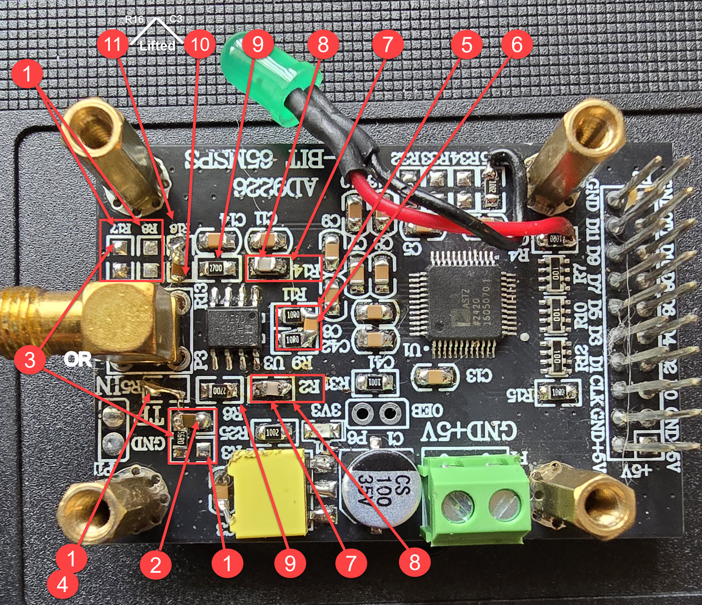
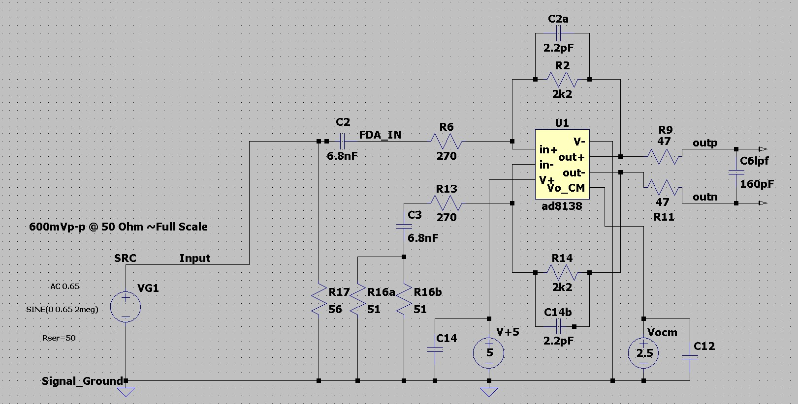

# AD9226 Module modification for VHS-Decode - ADC Capture - ~600mVp-p@050 Ohm FS

> [!NOTE]  
> Revision 0.2  
> 08-06-2026

## Gain configuration

## Configuration notes
* Target ADC input level for 650mVp-p - Gain set to ~4x gain
* R2 / R14 = 2.2kΩ
* R6 & R14 270Ω - **Do not change**

> [!NOTE]  
> SNR ~70dB  
> SINAD ~ 98/70dB  
> ENOB ~ 11bits

### Gain table

| Gain (times) | R2 & R14 (Ohm) | Vin (Vp-p) |
|--------------|----------------|------------|
| 1            | 560            | 2.5        |
| 1.2          | 680            | 2          |
| 1.7          | 910            | 1.5        |
| 2.5          | 1.2k           | 1          |
| 3            | 1.6k           | 0.9        |
| **4**            | **2.2k**           | **0.65**       |
| 4.1          | 2.4k           | 0.6        |

> [!CAUTION]
> Values above 2.4k are not recommended due to lower SNR

> [!TIP]
> Higher value rf/rg resistors -> higher Johnson noise  
> Analogue Devices AD8138 does not recommend rf <= 5k, I suggest rf <= 3k

## Modification

### Modification steps

1. **R3, R5, R8, R17** - **Remove** 
2. **R25** - **Replace** with 6.8nF capacitor 
3. **R17 OR R3/R25** node — **Add** 56OΩ resistor 
4. **R5** — **Add** the 0Ω resistor taken from R25 
5. **R9 & R11** — **Replace** with 47Ω resistor 
6. **C6lpf** — **Add** on the AD9226 side and **across R9/R11** add 160pF _- Provides 1-pole -3db@10MHz LPF & ADC kickback suppression_ 
7. **R2 & R14** — **Replace** with 2.2kΩ — Recommended gain 
8. **C2a/b** — **Add** 2.2pF capacitor **in parallel** on top of **R2 & R14** _- Stability and slight LPF roll off_ 
9. **R6 & R13** — Replace with 270Ω resistors 
10. **C3** — 6.8nF lifted at 45 deg for series with R16 _- added next_ 
11. **R16a/b** — **Add** two 51Ω resistors in parallel, one on top _- Add the resistors to ground side pad (AD9226 Text side) and lifted C3 in previous step. Provides DC offset balance_ 

### Board view

### Schematic

### BOM

| Type       | Value    | Ref        | Quantity |
|------------|----------|------------|----------|
| Resistor   | 47 Ohm   | R9, R11    | 2        |
| Resistor   | 51 Ohm   | R16        | 2        |
| Resistor   | 270 Ohm    | R6, R13    | 2        |
| Resistor   | 560 Ohm    | R17/R3-R25 | 1        |
| _Resistor_ | _2.2k Ohm_ | _R2, R14_  | _2_        |
| Capacitor  | 6.8 nF   | R16        | 1        |
| Capacitor  | 2.2 pF   | R2, R14    | 2        |
| Capacitor  | 160 pF   | R9/R11     | 1        |

**SMD, 0805**