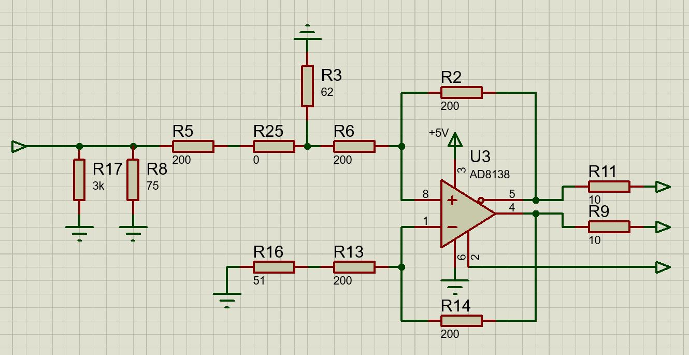
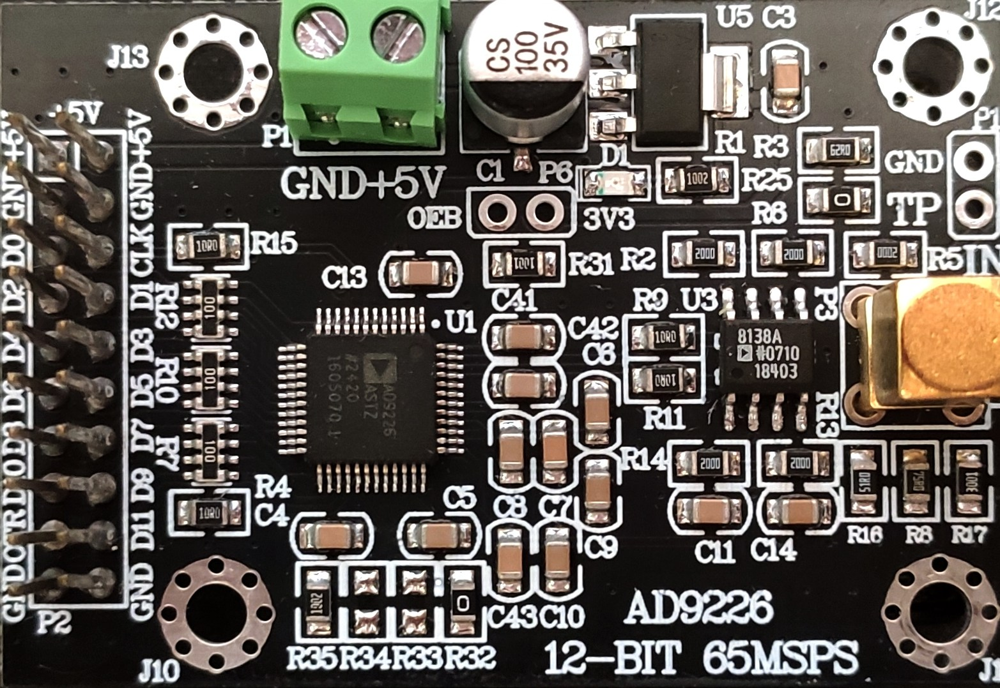
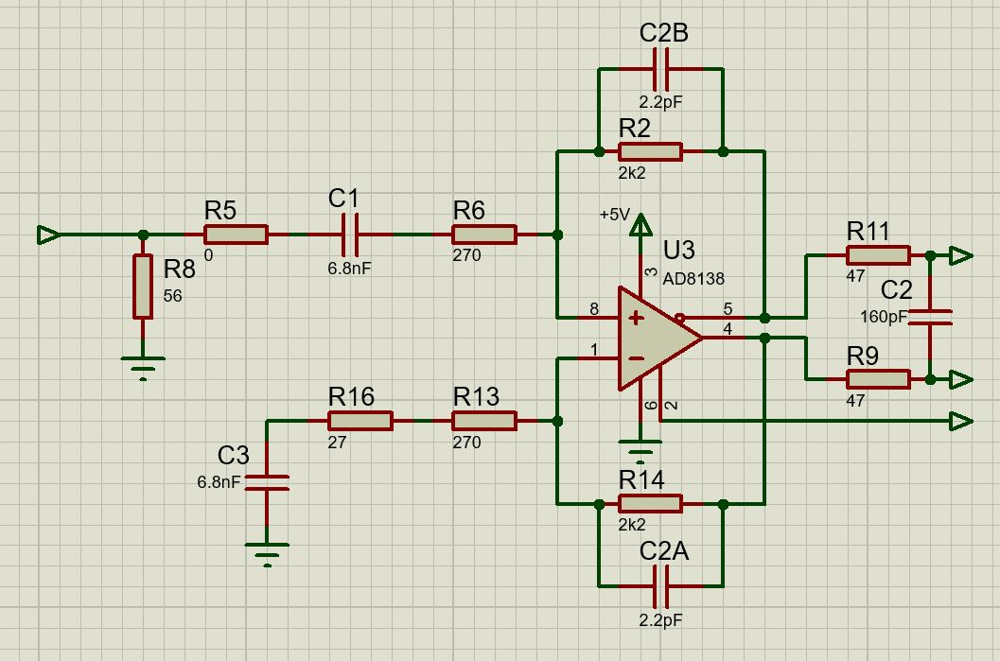

# AD9226 Module modification for VHS-Decode - ADC Capture - ~600mVp-p@050 Ohm FS

> [!NOTE]  
> Revision 0.4 
> 21-06-2026

<!-- TOC -->
* [Gain configuration](#gain-configuration)
* [Configuration notes](#configuration-notes)
  * [Gain table](#gain-table)
* [Modification](#modification)
  * [Gain setup](#gain-setup)
    * [Visual guide](#visual-guide)
  * [LPF and other improvements](#lpf-and-other-improvements)
  * [BOM](#bom)
<!-- TOC -->

## Gain configuration

## Configuration notes
* Target ADC input level for 650mVp-p - Gain set to ~4x gain
* R2 / R14 = 2.2kΩ
* R6 & R14 270Ω - **Do not change**

> [!NOTE]  
> SNR ~70dB 
> SINAD ~ 98/70dB 
> ENOB ~ 11bits

### Gain table

| Gain (times) | R2 & R14 (Ohm) | Vin (Vp-p) |
|--------------|----------------|------------|
| 1            | 560            | 2.5        |
| 1.2          | 680            | 2          |
| 1.7          | 910            | 1.5        |
| 2.5          | 1.2k           | 1          |
| 3            | 1.6k           | 0.9        |
| **4**            | **2.2k**           | **0.65**       |
| 4.1          | 2.4k           | 0.6        |

> [!CAUTION]
> **Values below 2.4k are not recommended** due to lower SNR

> [!TIP]
> Higher value rf/rg resistors lead to higher Johnson noise  
> Analogue Devices AD8138 does not recommend rf <= 5k, I suggest rf <= 3k

## Modification

**Stock variant**

**Stock board view**

### Gain setup

1. **R3, R5, R8, R17** - **Remove** 
2. **R8 or R17 or R3** — **Add** 56Ω resistor 
3. **R5** — **Add** 0Ω resistor _- Optionally taken from R25_ 
4. **R9 & R11** — **Replace** with 47Ω resistors 
5. **R2 & R14** — **Replace** with 2.2kΩ _- Recommended gain_ 
6. **R6 & R13** — Replace with 270Ω resistors 
7. **R16** — **Replace** with 27Ω resistor _- Provides DC offset balance_ 
8. **C3** — **Add** 6.8nF capacitor lifted at 45 deg in series with R16

### LPF and other improvements

1. **R25** - **Replace** with 6.8nF capacitor 
2. **C6lpf** — **Add** on the AD9226 side and **across R9/R11** add 160pF _- Provides 1-pole -3db@10MHz LPF & ADC kickback suppression_ 
3. **C2a/b** — **Add** 2.2pF capacitor **in parallel** on top of **R2 & R14** _- Stability and slight LPF roll off_ 

### BOM

| Type       | Value    | Ref        | Quantity |
|------------|----------|------------|----------|
| Resistor   | 27 Ohm   | R16        | 1        |
| Resistor   | 47 Ohm   | R9, R11    | 2        |
| Resistor   | 56 Ohm    | R17/R3-R25 | 1        |
| Resistor   | 270 Ohm    | R6, R13    | 2        |
| _Resistor_ | _2.2k Ohm_ | _R2, R14_  | _2_        |
| Capacitor  | 6.8 nF   | R16        | 1        |
| Capacitor  | 2.2 pF   | R2, R14    | 2        |
| Capacitor  | 160 pF   | R9/R11     | 1        |

**SMD, 0805**
